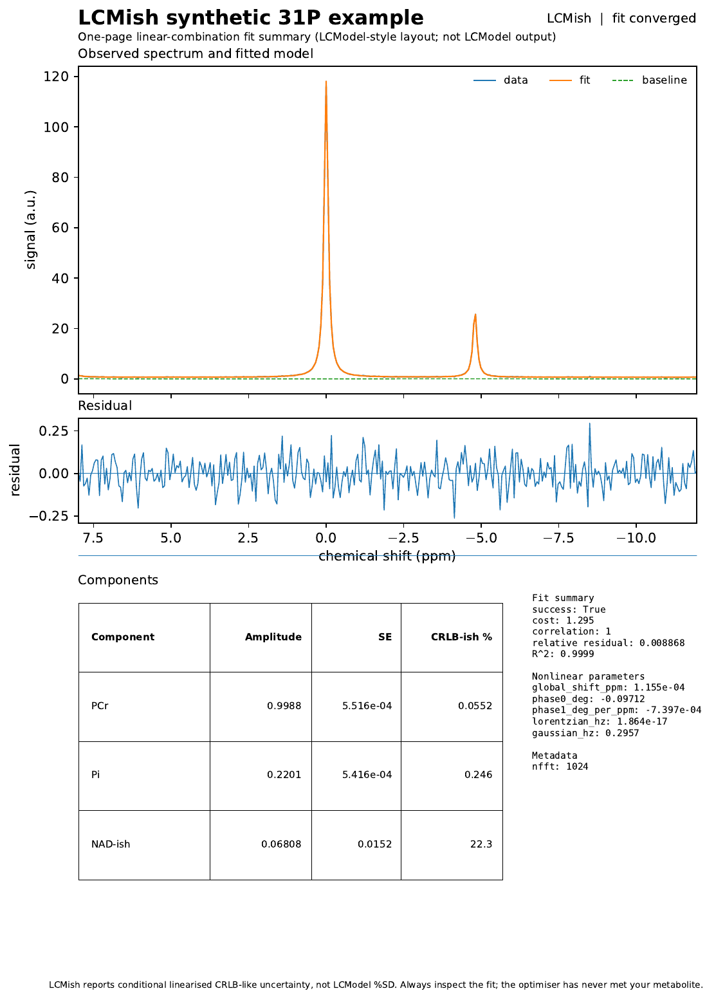
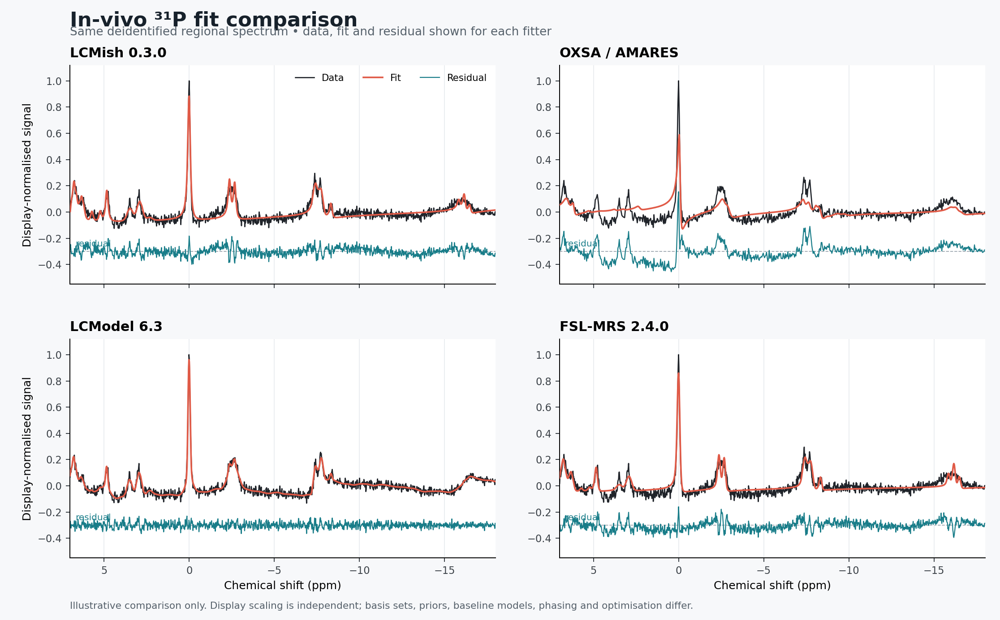

# LCMish

**Transparent linear-combination modelling for magnetic resonance spectroscopy.**

LCMish is a Python framework for fitting MR spectra with basis spectra, smooth baselines and a focused set of nonlinear nuisance parameters. It originated as an internal project called PyLCModel and retains that project's version lineage. The current public release is **0.3.0**.

The name is deliberate. LCMish performs **LCM-like** fitting. It is inspired by the general linear-combination modelling approach used by LCModel, but it is **not LCModel**, not an official port, and not a drop-in numerical replacement. Analyses that require LCModel-equivalent behaviour should use LCModel and validate the complete workflow accordingly.

> **Research-software status:** alpha. LCMish is intended for method development, transparent validation and research workflows with appropriate independent quality control.

## Why does this exist?

LCMish was developed to make spectroscopy fitting easier to inspect, modify, visualise and test. Its numerical components are exposed in Python so that modelling assumptions and implementation choices can be evaluated directly.

The immediate emphasis has been **³¹P MRS**, including PCr, Pi, ATP and NAD-region fitting, although the core fitter is nucleus-agnostic. The project provides a transparent environment for developing and testing linear-combination models alongside established spectroscopy software.

## What version 0.3 does

- fits the **real part of a zero-filled spectrum** using supplied basis spectra;
- uses separable / variable-projection-style optimisation, with linear amplitudes and baseline coefficients solved inside a nonlinear optimisation;
- supports global frequency shift, zero-order phase, first-order phase, Lorentzian broadening and Gaussian broadening;
- supports optional metabolite **groups** with shared shift and linewidth terms;
- supports non-negative metabolite amplitudes;
- uses a cubic B-spline baseline with second-difference regularisation;
- reads **NIfTI-MRS** `.nii` / `.nii.gz` as the preferred vendor-neutral spectroscopy input;
- reads common LCModel-style `.RAW` files;
- reads LCModel-style `.BASIS` files with LCModel-compatible component scaling, shifting and basis/data grid matching;
- provides multistart fitting;
- reports conditional amplitude standard errors and deliberately labels the corresponding percentages **CRLB-like**;
- provides ³¹P-oriented starting configurations;
- writes CSV, text-table, checkpoint, fit-figure and **single-page PDF summary** outputs;
- offers optional Siemens Twix access through `pymapvbvd`;
- provides an experimental local 31P NAD-region model for NAD+, NADH and
  neighbouring alpha-ATP, including nucleotide-sugar sensitivity analysis;
- provides an explicitly masked 2-D CSI convenience route with configurable
  voxel and fit QC, PCr alignment, phase correction and coherent combination;
- includes a ready-to-use, provenance-documented experimental Siemens 3 T brain
  31P basis in LCModel-style `.BASIS` form;
- supports current NumPy releases while retaining compatibility with older supported versions.

## Example output and cross-fitter context

LCMish produces a single-page fit report containing the observed spectrum, fitted model, baseline, residual, component estimates, uncertainty measures and fit diagnostics. The complete example is available as [`examples/LCMish_synthetic_fit_summary.pdf`](examples/LCMish_synthetic_fit_summary.pdf).

<p align="center">
  
</p>

*Synthetic example report generated by LCMish 0.3.0.*

The following figure uses the same deidentified in-vivo ³¹P regional spectrum in LCMish, OXSA/AMARES, LCModel and FSL-MRS. It is included to show the form of the fitted spectra and residuals, not to claim numerical equivalence. Display scaling is independent, and the fitters differ in basis or prior representation, baseline model, phasing and optimisation.



*Illustrative cross-fitter comparison on one deidentified regional spectrum; this is not a numerical equivalence claim.*

## What it does *not* yet do

LCMish 0.3 is not numerically equivalent to LCModel. Important behaviour still requiring implementation and/or systematic validation includes, among other things:

- LCModel's full prior model and concentration-ratio constraints;
- automatic regularisation selection equivalent to LCModel;
- the full LCModel lineshape model;
- exact LCModel `%SD` / CRLB calculations;
- macromolecule and lipid simulation controls;
- water scaling and absolute concentration calibration;
- eddy-current correction;
- complete `CONTROL`-file compatibility;
- byte-for-byte reproduction of LCModel output.

Accordingly, the uncertainty figures currently produced by LCMish are **conditional, CRLB-like estimates**, not LCModel `%SD`.

## Installation

Install the 0.3.0 wheel directly from the GitHub release:

```bash
python -m pip install https://github.com/frank-riemer/lcmish/releases/download/v0.3.0/lcmish-0.3.0-py3-none-any.whl
```

The redox module, masked 2-D CSI workflow, Siemens readers and starter basis are
all included in 0.3.0. Optional input dependencies can be requested from the
same wheel:

```bash
python -m pip install "lcmish[nifti] @ https://github.com/frank-riemer/lcmish/releases/download/v0.3.0/lcmish-0.3.0-py3-none-any.whl"
python -m pip install "lcmish[siemens] @ https://github.com/frank-riemer/lcmish/releases/download/v0.3.0/lcmish-0.3.0-py3-none-any.whl"
```

For development, clone the repository and install it in editable mode:

```bash
git clone https://github.com/frank-riemer/lcmish.git
cd lcmish
python -m pip install -e ".[test,nifti,siemens]"
python -m pytest
```

## Input formats

### NIfTI-MRS — preferred

[NIfTI-MRS](https://github.com/wtclarke/mrs_nifti_standard) is the preferred vendor-neutral input format. Scanner raw formats evolve, whereas a defined interchange standard provides the fitter with a stable input contract.

LCMish reads the complex time-domain signal, dwell time, spectrometer frequency, resonant nucleus, spatial affine and NIfTI-MRS JSON metadata. If `SpecFreqChemShift` is present it is used as the spectral-centre reference; it can always be overridden explicitly.

A normal preprocessed SVS file is deliberately simple:

```python
import lcmish

data = lcmish.read("subject.nii.gz")
print(data.metadata["nucleus"])
print(data.dwell_time_s, data.transmitter_mhz)
```

NIfTI-MRS can also contain MRSI voxels, uncombined coils, dynamics, edit states and other higher dimensions. LCMish **does not silently average or coil-combine these**. If more than one FID is present, select it explicitly:

```python
data = lcmish.read(
    "mrsi_or_dynamic.nii.gz",
    index=(x, y, z, dim5, dim6),
)
```

The index follows the stored non-spectral dimensions: `x, y, z`, then dimensions 5–7 if present. In ordinary workflows it is preferable to perform coil combination, alignment, averaging and edit-state arithmetic in a preprocessing package and provide LCMish with the resulting single-FID NIfTI-MRS file. This keeps scientific preprocessing decisions explicit and separate from file I/O.

LCMish uses **NiBabel** for NIfTI I/O. For strict format validation and manipulation of higher dimensions, the dedicated [`nifti-mrs`](https://pypi.org/project/nifti-mrs/) tools remain an excellent companion.

### LCModel-style RAW

`.RAW` remains supported for compatibility and validation work. Because RAW files do not always provide enough acquisition metadata consistently, dwell time and transmitter frequency are explicit:

```python
data = lcmish.read(
    "subject.RAW",
    dwell_time_s=1 / 3000,
    transmitter_mhz=51.7,
    reference_ppm=0.0,
)
```

### Scanner raw data

Siemens Twix access remains available separately through `read_twix()` and `pymapvbvd`. It returns the raw complex array without guessing which dimensions are voxels, coils or averages. This is intentional.

LCMish does **not** currently parse GE P-files (`.7`) or GE ScanArchive directly. GE raw formats have changed across software generations, and maintaining robust compatibility requires dedicated development and validation. Upstream conversion or reconstruction to NIfTI-MRS is the preferred route. The same principle applies to other vendor-specific raw formats.

## A small example

```python
import lcmish
from lcmish import read_basis, fit_spectrum, p31_brain_config

data = lcmish.read("subject.nii.gz")

basis = read_basis(
    "my31p.BASIS",
    transmitter_mhz=data.transmitter_mhz,
    reference_ppm=data.reference_ppm,
)

result = fit_spectrum(
    data,
    basis,
    p31_brain_config((-20.0, 10.0)),
)

result.save_csv("fit.csv")
result.save_pdf("fit.pdf", title="LCMish 31P fit")
result.plot("fit.png")
print(result.nonlinear)
print(result.summary_rows())
```

### The one-page summary

LCMish can write a single-page PDF summary containing the spectrum, fit, residual and key numerical results:

```python
result.save_pdf("fit.pdf", title="LCMish 31P fit")
```

The report contains the observed spectrum, fitted model, baseline, residual, component amplitudes, conditional standard errors, CRLB-like percentages, nonlinear fit parameters and basic fit diagnostics. The layout is familiar to LCModel users, while every page is labelled **LCMish** and explicitly states that it is not LCModel output.

The command-line interface writes this PDF automatically as `<output>.pdf`, alongside the machine-readable outputs. No PostScript dependency is required.

A rendered synthetic example is included at [`examples/LCMish_synthetic_fit_summary.pdf`](examples/LCMish_synthetic_fit_summary.pdf).

The command-line equivalent for NIfTI-MRS is:

```bash
lcmish subject.nii.gz my31p.BASIS \
  --ppm-min -20 --ppm-max 10 \
  --out subject_fit
```

For LCModel-style RAW input, add `--dwell`, `--f0` and, where appropriate, `--ref-ppm`. For a multi-FID NIfTI-MRS file, `--index x y z ...` makes the selection explicit.

## ³¹P grouped fitting

For ³¹P work, `p31_brain_grouped_config()` provides a starting model with shared nonlinear terms for sensible component groups where the supplied basis names permit it. It is a starting configuration, not a revealed truth. Inspect it, change it and report what you used.

```python
from lcmish import p31_brain_grouped_config

config = p31_brain_grouped_config((-20.0, 10.0))
```

For difficult spectra, multistart fitting is available:

```python
from lcmish import fit_spectrum_multistart

starts = (
    {},
    {"initial_phase0_deg": -8.0, "initial_phase1_deg_per_ppm": -3.0},
    {"initial_phase0_deg":  8.0, "initial_phase1_deg_per_ppm":  3.0},
    {"initial_lorentzian_hz": 1.0, "initial_gaussian_hz": 12.0},
)

audit = fit_spectrum_multistart(data, basis, config, starts=starts)
result = audit.best
```

The selected fit is the trial with the smallest optimisation cost. Visual inspection and the reported diagnostics remain necessary.

## Experimental NAD-region fitting and masked 2-D CSI workflow

The generic `fit_p31_redox()` function accepts a single preprocessed complex
spectrum and fits a literature-constrained local model over the upfield
alpha-ATP/NAD region. The result is labelled an **apparent** NAD+/NADH ratio.
It is not returned as reportable when NADH is boundary-limited or the configured
quality criteria fail.

`fit_p31_csi_redox()` is a deliberately narrower convenience workflow. It
expects reconstructed complex data with shape `(row, column, time)`, an explicit
Boolean voxel mask, and study-specific QC thresholds. It calculates a robust
PCr-SNR map, excludes masked voxels that fail the configured threshold, aligns
and phases retained voxels individually, combines them coherently, and fits the
local NAD model with an optional nucleotide-sugar sensitivity analysis.

```python
from lcmish import (
    CSIData,
    P31CSIRedoxQCConfig,
    fit_p31_csi_redox,
)

csi = CSIData(fids, dwell_time_s, transmitter_mhz)
qc = P31CSIRedoxQCConfig(
    pcr_snr_min=10.0,
    min_retained_voxels=3,
    local_fit_correlation_min=0.85,
    local_relative_residual_max=0.55,
)
result = fit_p31_csi_redox(csi, study_specific_mask, qc)
print(result.qc_pass, result.qc_reasons)
print(result.apparent_redox_ratio)
```

The route was designed for 2-D 31P-CSI after study-specific anatomical voxel
selection. LCMish does not infer mask anatomy or scanner orientation. Use with
single-voxel data, other field strengths, localization schemes, scanners or
masking strategies may require adaptation and independent validation. See
`examples/p31_2d_csi_redox.py` for a complete synthetic example. Cohort-level
composites, participant bootstrap and treatment-label permutation tests remain
study-analysis responsibilities rather than general LCMish functions. Passing
the convenience workflow's QC does not by itself validate participant-level
redox quantification; studies using group composites should prepare each scan
with `prepare_p31_csi_redox()`, construct the prespecified composites in their
analysis code, and then apply `fit_p31_redox()`.

## Basis sets and redistribution

LCMish can **read** LCModel-style `.BASIS` files. That does not mean every basis file may be redistributed.

Version 0.2.2 follows LCModel's basis-input conventions for `NDATAB`, `TRAMP/(VOLUME*CONC)` scaling, `ISHIFT`, the 4.65-ppm carrier-grid correction, unitary inverse-FFT normalization and basis/data bandwidth matching. It also preserves narrow-band basis signal over LCModel's internal `NDATA=2*NUNFIL` model duration. This is LCModel-compatible basis handling; it is not a claim that the complete LCMish fitter is numerically equivalent to LCModel.

This repository therefore does **not** ship the private/internal ³¹P basis sets used during development. Before distributing any basis set, its provenance and redistribution terms must be established. The BSD licence for LCMish covers the LCMish code and does not re-license third-party spectra.

### Bundled experimental brain 31P basis

LCMish 0.3 includes a ready-to-use, provenance-clean basis named
`LCMish_Brain_31P_Haukeland_Siemens3T_1024.BASIS`. It describes a representative
proton-decoupled Siemens 3 T 31P CSI-FID acquisition at Haukeland University
Hospital. Its metadata contain no trial or participant identifiers:

- 1024 acquired complex points;
- 0.5 ms dwell time (2000 Hz spectral width);
- 49.891996 MHz 31P transmitter frequency;
- PCr referenced to 0 ppm.

The basis retains 2048 time-domain model points. An exported LCModel-style file
therefore uses `NDATAB=4096`, following LCModel's internal-duration convention;
this does not mean that the acquisition contained 4096 points.

```python
from lcmish import load_p31_brain_basis

basis = load_p31_brain_basis()
```

The basis includes PE, PC, extracellular and intracellular Pi, GPE, GPC, PCr,
alpha/beta/gamma ATP, NAD+ and NADH. Proton-decoupled monophosphate and
phosphodiester signals are represented as singlets; ATP retains its 31P-31P
couplings; NAD+ uses a field-dependent AB quartet. UDPG, other nucleotide
sugars, 2,3-DPG and the broad membrane-phospholipid background are deliberately
not included in version 0.1.0 because their inclusion requires adequately
supported spectral models and prior constraints.

This is an **experimental reference basis**, not a universal brain basis.
Chemical shifts are starting values, Pi is pH-dependent, and use with another
sequence, scanner, field strength, tissue or decoupling scheme requires
independent validation. The accompanying JSON sidecar records the acquisition
grid, assumptions, component list and primary literature references.

The `.BASIS` file and its JSON provenance sidecar are distributed in both the
wheel and source archive. Their integrity and expected peak positions are
checked by the test suite.

See [`THIRD_PARTY.md`](THIRD_PARTY.md) for licence, provenance and redistribution information.

## Relationship to LCModel

LCModel was developed by **Stephen Provencher**. Its source code has been released separately under a BSD 3-Clause licence. LCMish is an independent Python project for exploring and validating linear-combination MRS fitting. It does not include the LCModel source or executable and is not endorsed by the LCModel author or maintainers.

Compatibility with LCModel-style file formats is intended to make validation easier, particularly direct comparison of the same data and basis information across fitting implementations.

An ongoing development goal is to expand the regression suite comparing LCMish with established fitting tools on synthetic and real spectra. Visual comparisons are accompanied by numerical evaluation wherever the models can be matched appropriately.

### v0.2.2 basis validation

The corrected basis path was checked against a locally compiled LCModel reference and FSL-MRS 2.4.0 using a matched 12-component ³¹P synthetic mixture with deliberately different basis and data grids. LCModel recovered every PCr-relative ratio to the precision displayed in its coordinate output; LCMish and FSL-MRS supplied with the corrected arrays recovered the input ratios to approximately `1e-7` or better.

FSL-MRS's direct reader for the tested LCModel `.BASIS` file produced an approximately 4.65-ppm carrier offset, so it was not used as the basis-import oracle. This finding concerns that file and reader path, not the general correctness of the FSL-MRS fitter.

On a deidentified real ³¹P spectrum, the three fitters still produced materially different estimates for several overlapping components. The v0.2.2 validation therefore supports LCModel-compatible **basis handling**, not LCModel-equivalent real-data quantification. Baseline behavior, priors, staged optimization, lineshape constraints and uncertainty estimation remain distinct.

## Development and AI assistance

Early versions were developed through human–AI pair programming between **Frank Riemer** and **OpenAI's ChatGPT**.

ChatGPT contributed code generation, refactoring, documentation and test scaffolding. Scientific direction, modelling decisions, validation, review and responsibility for releasing the software remain human responsibilities.

LCMish is therefore described as **AI-assisted**. Contributions are expected to include appropriate tests and validation evidence regardless of how the code was produced.

See [`AUTHORS.md`](AUTHORS.md) for the formal credit statement.

## Validation philosophy

The order of operations is:

1. make the model inspectable;
2. test it on known synthetic cases;
3. compare fitted amplitudes, shifts, phases, linewidths, baselines and residuals against established software;
4. quantify and investigate disagreement;
5. only then use new behaviour for biological inference.

For ³¹P work, particularly NAD-region fitting, validation should include sensitivity to basis composition, baseline placement, linewidth, phase, spectral registration and metabolite grouping. Separating NAD⁺ and NADH because the optimiser returned two numbers is not, on its own, evidence that the experiment contained enough information to distinguish them.

## NumPy compatibility

Internal PyLCModel 0.2.1-era analysis scripts needed a temporary compatibility shim because newer NumPy versions removed `np.trapz`. LCMish fixes this in the package itself: numerical integration uses `numpy.trapezoid` where available and falls back to `numpy.trapz` for older supported versions.

User scripts therefore do not need a compatibility shim for this API change.

## Reproducibility

If you use LCMish in a paper, please report at minimum:

- LCMish version;
- acquisition nucleus and field strength;
- basis-set provenance/version;
- fit ppm range;
- metabolite grouping;
- bounds on shifts, phase and linewidth;
- baseline spacing/regularisation;
- amplitude constraints;
- multistart strategy, if used;
- QC and exclusion criteria;
- whether reported uncertainty is the current conditional CRLB-like estimate.

Reporting the effective configuration is preferred to stating only that default settings were used, because defaults may change between releases.

## Licence

LCMish is released under the **BSD 3-Clause License**. See [`LICENSE`](LICENSE).

That licence applies to LCMish code. Third-party basis sets, scanner data, example data obtained elsewhere and external software retain their own licences and terms. See [`THIRD_PARTY.md`](THIRD_PARTY.md).

## Contributing

Contributions, comparisons, bug reports and validation results are welcome. See [`CONTRIBUTING.md`](CONTRIBUTING.md).

Bug reports should contain enough information to reproduce the issue, including relevant input metadata, configuration and observed output where redistribution permits.

---

**LCMish 0.3.0**.
