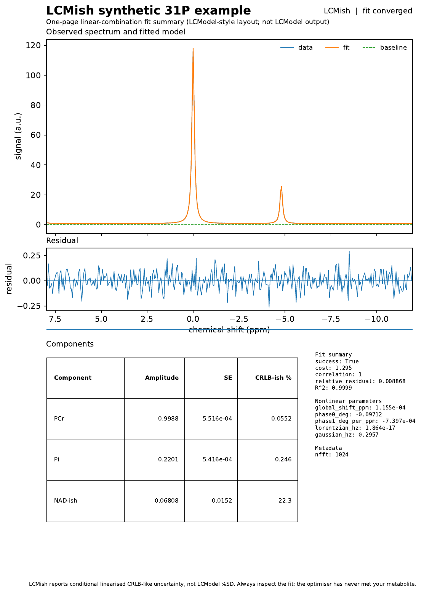
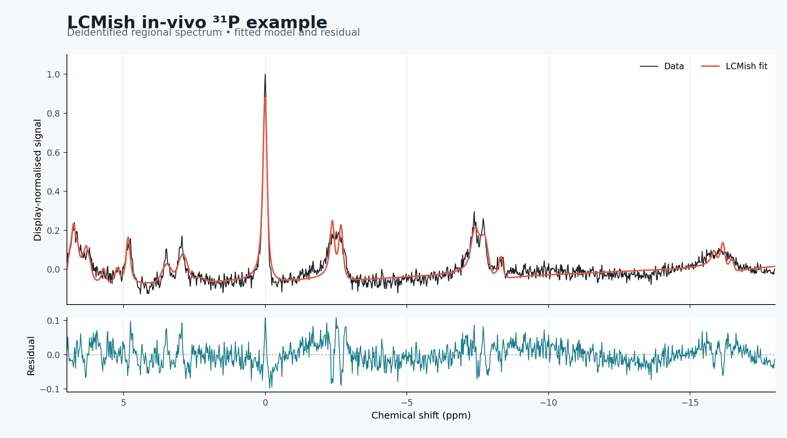

# LCMish

Lightweight, native multinuclear spectral fitting in Python.

LCMish was developed to meet a need for a lightweight Python fitter that models MR spectra in the frequency domain with supplied basis signals and a fitted smooth baseline. Multinuclear modelling is native to the core: it uses the acquisition's frequency, dwell time and chemical-shift reference rather than assuming proton data. The same general API accepts ¹H, ³¹P and other nuclei with an acquisition-matched basis and configuration.

A central feature is ³¹P NAD-region/redox fitting, including field-dependent NAD+ and NADH models, non-NAD phase estimation, an optional alpha-ATP phase term and linked nucleotide-sugar modelling. Whole-spectrum linear-combination fitting and the specialised redox model are available through the same Python package.

LCMish runs with NumPy, SciPy and Matplotlib, without a proprietary fitting-software licence, MATLAB runtime or external fitting executable. MATLAB-prepared complex vectors, NIfTI-MRS and LCModel-style RAW are supported input routes. The numerical components are exposed so that models, baselines and fitting assumptions can be inspected and adapted.

LCMish is independent of LCModel: it is not an official port or a drop-in numerical replacement. Research-software status is alpha. Development and validation have concentrated on ³¹P; native multinuclear support is not a claim of validated performance for every nucleus, sequence or acquisition.

## Core capabilities

- ³¹P NAD-region/redox fitting with NAD+ AB-quartet and NADH models, non-NAD phase estimation, alpha-ATP phase handling and optional linked nucleotide sugars.
- Selectable fitting of both real and imaginary channels (`complex`), real only (`real`), imaginary only (`imag`) or magnitude (`magnitude`) in both general and redox fitters.
- Whole-spectrum linear-combination fitting with a regularised cubic B-spline baseline; a polynomial baseline for the local redox model.
- Frequency shift, zero- and first-order phase, Lorentzian/Gaussian broadening and optional shared metabolite-group parameters.
- Nonnegative amplitudes, multistart fitting and conditional amplitude uncertainty; residual bootstrap is available for redox.
- Direct complex-array input, NIfTI-MRS, LCModel-style RAW/BASIS, and optional Siemens Twix/DICOM CSI readers.
- Masked 2-D ³¹P CSI preparation with voxel QC, PCr alignment, phasing and coherent combination.
- A provenance-documented experimental Siemens 3 T brain ³¹P basis.
- Component tables, complex residuals, figures and one-page PDF reports.

The general fitter defaults to `complex`; redox retains its `real` default. Aliases `both`, `imaginary` and `mag` are accepted. Magnitude fitting uses the magnitude of the coherent component sum, not the sum of component magnitudes. Common phase is not estimated in that mode, and magnitude-noise bias is not corrected. See [fitting modes and examples](examples/README.md#fitting-modes).

## Installation

Python 3.10 or newer is required. Install the 0.4.0 wheel, including the optional NIfTI reader:

```bash
python -m pip install "lcmish[nifti] @ https://github.com/frank-riemer/lcmish/releases/download/v0.4.0/lcmish-0.4.0-py3-none-any.whl"
```

Alternatively, work directly from the source repository:

```bash
git clone https://github.com/frank-riemer/lcmish.git
cd lcmish
python -m pip install -e ".[nifti]"
```

For Siemens readers, add the `siemens` extra; for tests, add `test`:

```bash
python -m pip install -e ".[nifti,siemens,test]"
python -m pytest
```

The core does not require the optional readers when passing a complex vector directly. All redox and phase-estimation features are part of this codebase; no separate feature-specific installation is needed.

## Preprocessing and fitting responsibilities

“Before fitting” means preparing the complex data in your chosen reconstruction/preprocessing software, which may be MATLAB. Reading a file is not the same as correcting an acquisition.

| Task | General fitter | ³¹P CSI/redox route |
|---|---|---|
| Scanner reconstruction and sequence phase cycling | Prepare before fitting | Prepare before fitting |
| Acquisition-delay and receiver-gain correction, when needed | Apply before fitting | Apply before fitting |
| Coil combination and water-based eddy-current correction | Apply before fitting | Apply before fitting |
| Frequency alignment and phasing | Fits residual shift/phase | CSI preparation aligns PCr and phases voxels; redox phase estimation can use non-NAD peaks |
| Spectral baseline | Fits a smooth spline | Fits a local polynomial |
| Water-referenced/absolute concentration scaling | Separate calibration after fitting | Separate calibration after fitting |

The fit's residual phase/frequency parameters do not replace validated reconstruction. Water can support coil weighting, eddy-current correction and concentration referencing, but these are separate operations. Fitted amplitudes are not automatically absolute concentrations. Details are in the [input and workflow guide](examples/README.md).

## Examples and workflows

The [examples guide](examples/README.md) contains code and explanations for:

- [Loading NIfTI-MRS or RAW](examples/README.md#nifti-mrs-and-raw).
- [Loading just a complex MATLAB vector](examples/README.md#complex-vectors-from-matlab), with metadata supplied separately or saved alongside it.
- [Choosing real, imaginary, complex or magnitude fitting](examples/README.md#fitting-modes).
- [Whole-spectrum fitting and configuration](examples/README.md#whole-spectrum-fitting).
- [Prepared ¹H and voxelwise MRSI](examples/README.md#1h-and-voxelwise-mrsi).
- [Redox fitting, non-NAD phase estimation and linked sugars](examples/README.md#redox-fitting-and-phase-estimation).
- [Masked 2-D CSI and Siemens readers](examples/README.md#masked-csi-and-siemens-readers).

GE P-files/ScanArchive are not decoded directly. Reconstruct them with a validated external reader, preprocess the complex FIDs, then use the MATLAB-vector, NIfTI-MRS or RAW route. NIfTI conversion is not mandatory.

## Example output

LCMish reports the spectrum, model, baseline, residuals, fitted amplitudes and diagnostics. An [example PDF](examples/LCMish_synthetic_fit_summary.pdf) illustrates the report layout.

<p align="center">
  
</p>

An in-vivo ³¹P example shows the model and residual for a phase-corrected mean of eight retained voxels, fitted from +10 to −20 ppm:



These illustrations are not cross-fitter validation.

## Basis sets and limitations

Use a basis matched to nucleus, field/frequency, sequence, timing and complex spectral convention. LCModel-compatible file/grid handling does not adapt an inappropriate physical basis to your acquisition.

The package includes an experimental proton-decoupled Siemens 3 T brain ³¹P basis and a JSON provenance sidecar. It is not a universal basis and is not a proton basis. Private development bases are not redistributed; third-party basis licences remain separate from the software licence. See [basis details](examples/README.md#basis-and-acquisition-assumptions) and [THIRD_PARTY.md](THIRD_PARTY.md).

LCMish does not reproduce LCModel's complete priors, automatic regularisation, lineshape model or %SD calculations. Its reported errors are conditional, CRLB-like estimates, not LCModel %SD. Water scaling, absolute calibration and eddy-current correction are not automatic.

For ³¹P, particularly NAD-region fitting, check sensitivity to basis composition, baseline, linewidth, phase, spectral alignment and grouping. Two fitted NAD coefficients alone do not establish that NAD+ and NADH are identifiable. The reported redox quantity is an apparent spectral ratio, not a calibrated free cytosolic or mitochondrial redox ratio. Proton-decoupling, NOE and relative acquisition response require appropriate interpretation; [model assumptions](examples/README.md#basis-and-acquisition-assumptions) explain the boundaries.

## Reproducibility

Report the software version/commit and basis, then describe settings or processing that differ from the documented defaults: fitting mode, window, constraints, baseline, grouping, calibration and QC. Save the effective configuration with results rather than copying a long list of defaults into a manuscript.

## Credit, licence and contributions

LCMish began as PyLCModel and was developed through human–AI pair programming between Frank Riemer and OpenAI's ChatGPT. Scientific decisions, validation and release responsibility remain human responsibilities. See [AUTHORS.md](AUTHORS.md).

LCMish uses the BSD 3-Clause [licence](LICENSE); third-party inputs retain their own terms. Contributions and validation comparisons are welcome; see [CONTRIBUTING.md](CONTRIBUTING.md).
